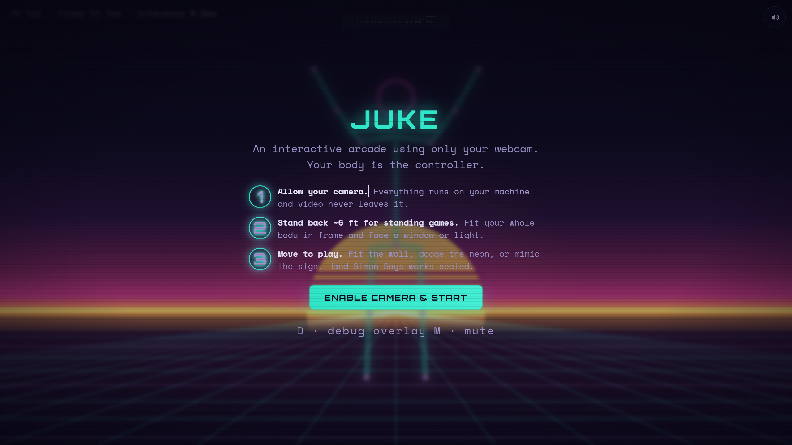
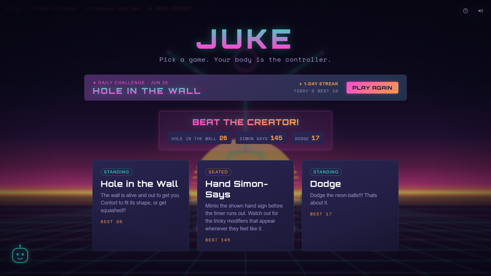
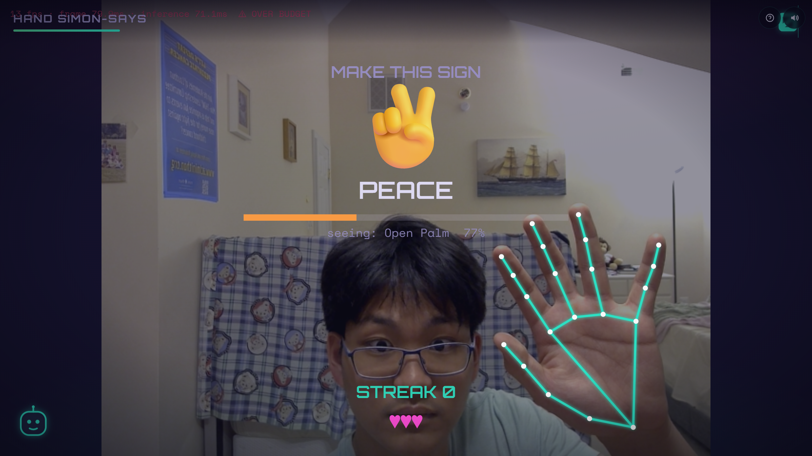

# Juke

> Juke is an interactive webcam arcade that you play with your body. There is no controller, no install, and all in the comfort of your own home.

[](https://youtu.be/bev4zV3mYlE)

▶ **[Watch the demo](https://youtu.be/bev4zV3mYlE)**

## What it is

Arcades used to be a very popular place to spend time. However, the age of modern computing and new technologies have made arcades outdated and not worth driving to for many people. Juke aims to bring back the neon lights and interactive games of the arcade into the modern era with the help of computer vision and AI. 

Juke is an arcade you play with your webcam instead of a keyboard, where your body is the controller. There is nothing to download and nothing to install. All you have to do is open the website and play. The camera actively reads your shape, tracks where your limbs are, and processes them using AI in order to determine your orientation to use as input to the games. 

Currently, Juke has 3 games. The first game, Hole-in-the-wall, is a classical game adapted for your computer and webcam. A moving wall with a human cutout approaches you, and you must twist and contort your body in order to fit the gaps or get squashed. Simon-Says is the second game, where you must match your hand to mimic the one shown on screen. Beware of the tricky modifiers such as Simon-Says mode and Mirror. The last game is Dodge, a game where neon-balls fall from the sky. You must dodge these balls and avoid them for as long as possible. All of the games get progressively more difficult as the rounds progress, adding an extra element of intensity. The games are also specifically calibrated to your specific setting, taking into account your position and distance in order to scale the game to the correct settings and proportions. After you die, you can download sharecards of your game which capture specific games and your progress. 

If players are up for the challenge, they can attempt the daily challenge or even try to beat the creator's own best at the different games.

## The games

- **Hole-in-the-Wall**: A wall with a person-shaped gap rushes at you. Contort to fit through or get squashed.
- **Hand Simon-Says**: Seated and laptop friendly. Mimic the hand sign before the timer runs out.
- **Dodge**: Neon objects fly in from every side. Slip, duck, and weave your whole body out of the way.

## Screenshots


_The start screen walks you through camera setup before you play._


_Pick a game from the menu, take on the daily challenge, or try to beat the creator's best._


_Hand Simon-Says reading a peace sign in real time. This one you can play seated._

## Play it

🔗 **Live:** https://biglyning.github.io/Juke/

Stand around ~6 feet away from the webcam for standing games. Clear your surrounding and try to fit your whole body in shot for the best results and smoothest gameplay. Try not to move closer or further away from the camera during rounds.

## Tech stack

- **TypeScript 5.9** for all of the game code, written plain with no game framework underneath it.
- **Vite 5** for the build tool and the dev server.
- **A single HTML canvas** that fills the window. Everything that you see is drawn onto that one canvas every frame.
- **MediaPipe Tasks Vision 0.10** from Google for the camera smarts. One model finds your body and the outline around it. A second model reads your hand shape for the Simon-Says game. Both run on the GPU so they keep up in real time.
- **No backend at all.** There is no server, no database, and no account. Data is never collected and never leaves your machine.

It ships as a plain static site and is hosted on GitHub Pages.

## How it works

The game runs constantly in a loop, and every frame goes through the same few steps in order. First, the camera captures a fresh picture and hands it over to MediaPipe. MediaPipe scans the image and pulls out a set of points for where each of your body parts are, along with a rough cutout of your shape against the background. For the hand game it instead reads the shape your hand is making, using the orientation of your fingers and joints in order to figure out which symbol you are showing.

All of that information condensed into a small set of numbers that the rest of the game uses. The games themselves never talk to the camera or to MediaPipe directly, and instead only see these numbers. This allows all three games to share a single engin, as each game is handed the same kind of input  and simply decides what to do with it.

Then the active game's turn to run. Hole-in-the-Wall checks whether your shape fits the gap. Dodge checks whether any of the balls have hit you. Simon-Says checks whether your hand matches the shown symbol. After that, the whole scene gets drawn onto the screen, and an overlay adds the details on top, including the screen shake, the particles, and the sound.

## Why I built it

I remember going to Chuck-E-Cheese and Dave & Buster's back in the day and playing those arcade games. Those were some of my best childhood memories, but the age of arcades is far gone as video games have completely taken over the entertainment industry. I made Juke as an attempt to try to bring back the feel of an arcade to a newer generation who might have never even been in an arcade. 

The idea to make Juke controllerless was to make Juke both a callback to arcades and a fun way to get some exercise in. Your body being the controller encourages players to move around and become healthier in the process of playing. Juke, however, also has a seated game which also allows those who are too tired or have trouble moving around play as well.

My last project was on audio, so Juke was made physical in order for me to try a new form of interaction and learn something new. I was initially worried that the game would not be able to process the live video input, process and segment it, and determine the users accurate position relative to the game, all while feeling like a live game. However, I was pleasantly surprised when it ended feeling relatively responsive and surprisingly reactive.

## Run it locally

You need Node installed (built and tested on Node 22). The camera only works on a secure page, but your own machine is treated as safe, so a plain local development is fine.

```bash
npm install
npm run dev      # starts the dev server, open the printed local link
npm run build    # makes the static production build
npm test         # runs the unit tests
```

## Status and roadmap

Currently, Juke has 3 fully implemented games, reactive audio, and visual effects for immersion and vibe. 

See [IMPLEMENTATION.md](IMPLEMENTATION.md) for the full phase-by-phase plan and build status.

## Development note

[Claude Code](https://claude.com/claude-code) was used in the development of Juke.
